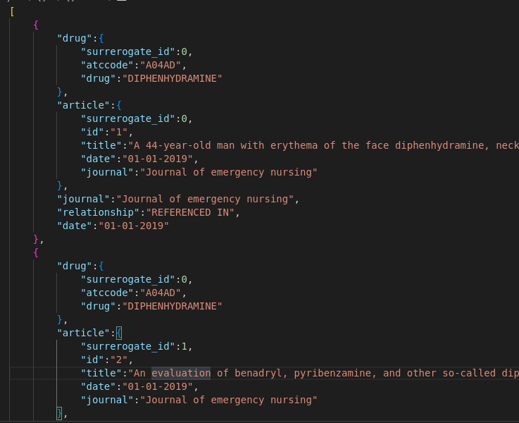
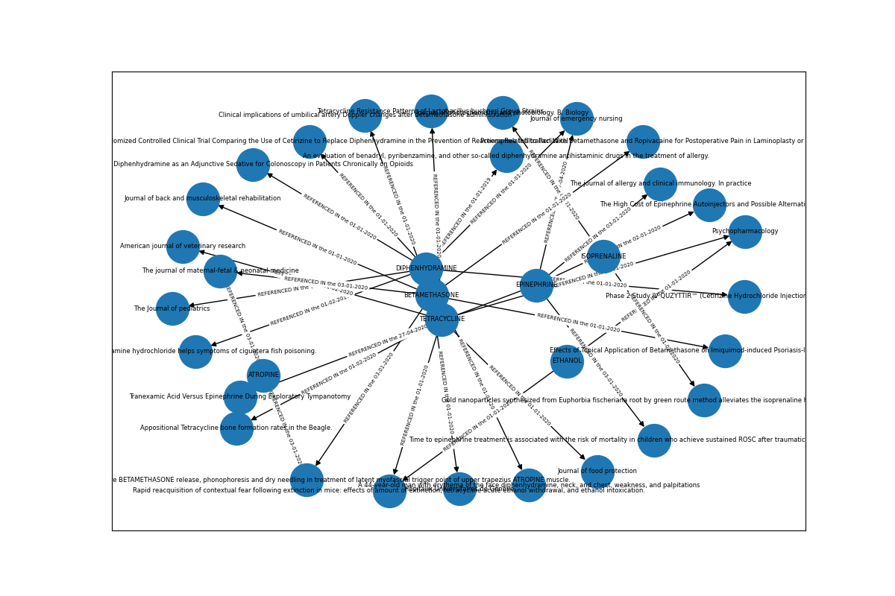

# Python_ETL

L'objectif de ce repository est de créer un ETL (Extract-Transform-Load) rudimentaire en Python.
L'ETL est composé des trois composants suivants : 
* **Extract** : extraction des données sources vers des dataframes Pandas. Ici les données sources sont des fichiers plats (CSV, JSON).
* **Transform** : la partie critique de l'ETL.
    * vérification des contraintes techniques (exemple : type des variables)
    * vérifcation des contraintes fonctionnelles métier (exemple : chaque étude doit avoir un titre)
    * structuration des données : base de données orientée graphe (format NetworkX "edgelist") 
* **Load** : chargement des données dans leur emplacement final. Ici dans un fichier JSON.

L'ETL charge les données à partir d'un dossier défini par l'utilisateur (ici `data`), les traite puis les charge dans le fichier `data.json` :

On peut également générer un graphe à partir du fichier obtenu à l'aide de `graph.py` : 

## Insights

Le journal mentionnant le plus de médicaments différents est "Journal of emergency nursing" avec 6 occurences.

## Exécuter

- `pip install -r requirements.txt`
- `python main.py`

## Pistes d'améliorations (pour grosses volumétries de données)
- traitement par batch
- distribuer les tâches de l'ETL sur plusieurs machines
- utiliser un framework plus adapté comme Spark, voire un langage plus rapide comme Scala ?